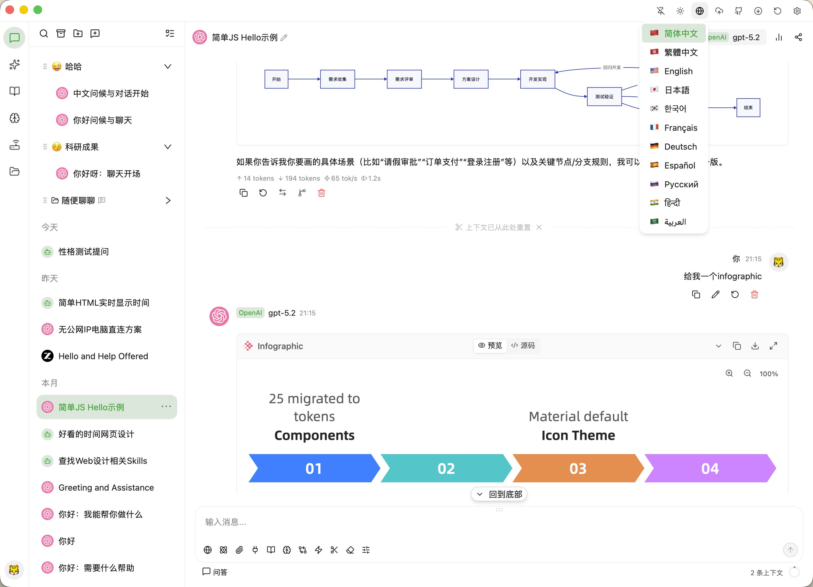

[English](./README-EN.md) | [简体中文](./README.md) | [繁體中文](./README-ZH-TW.md) | [日本語](./README-JA.md) | [한국어](./README-KO.md) | [Français](./README-FR.md) | [Deutsch](./README-DE.md) | [Español](./README-ES.md) | [Русский](./README-RU.md) | [हिन्दी](./README-HI.md) | **العربية**

[](https://github.com/polite0803/AxAgent)

<p align="center">
  <a href="https://www.producthunt.com/products/axagent?embed=true&amp;amp;utm_source=badge-featured&amp;amp;utm_medium=badge&amp;amp;utm_campaign=badge-axagent" target="_blank" rel="noopener noreferrer"></a>
</p>

<p align="center">
  <strong>تحليل الاستثمار الذكي المدعوم بالذكاء الاصطناعي | تعاون متعدد الوكلاء | المحلي أولاً</strong>
</p>

<p align="center">
  <a href="https://github.com/polite0803/AxAgent/releases" target="_blank">
    
  </a>
  <a href="https://github.com/polite0803/AxAgent/actions" target="_blank">
    
  </a>
  
  
</p>

---

## ما هو AxInvest؟

**AxInvest v2.3** هي منصة تحليل استثمار ذكية مدعومة بالذكاء الاصطناعي، مبنية على إطار عمل AxAgent متعدد الوكلاء. تدمج قدرات وكلاء AI المتقدمة مع تحليل الاستثمار الاحترافي لأسهم A بشكل عميق، وتدعم مزودي نماذج متعددين، وبحث وكلاء AI، وتنسيق سير العمل المرئي، وإدارة المعرفة المحلية، وبوابة API مدمجة، وتغطي خمس منصات رئيسية **Windows / macOS / Linux / Android / iOS**، مع تخطيط متكيف لثلاث فئات من الأجهزة: **سطح المكتب والجهاز اللوحي والهاتف**.

تكمن الميزة الأساسية لـ AxInvest في استخدام آليات مثل النقاش المضاد متعدد الوكلاء، والبحث المتعمق، والتحقق من الحقائق لتقديم دعم تحليلي شامل وموضوعي لقرارات الاستثمار.

---

## لقطات الشاشة

| المحادثة واختيار النموذج | لوحة تحكم الوكلاء المتعددين |
|:---:|:---:|
|  |  |

| قاعدة المعرفة RAG | الذاكرة والسياق |
|:---:|:---:|
|  |  |

| محرر سير العمل | بوابة API |
|:---:|:---:|
|  |  |

---

## الميزات الرئيسية

### 📈 تحليل الاستثمار الذكي

وحدة الميزة الأساسية في AxInvest، تدمج قدرات وكلاء AI مع تحليل الاستثمار الاحترافي بشكل عميق:

**تجميع بيانات متعدد المصادر مع التدهور**

- **9 مصادر بيانات** — تينسنت المالية، تونغداشين (mootdx)، دونغفانغ كايفو، شينا المالية، بايدو للأسهم، تونغهواوشون (THS)، وينتساي (Iwencai)، جوتشاو (cninfo)، AKShare
- **22 مسار بيانات** — كل نوع بيانات مُكوّن بمسار تدهور متعدد المصادر، يتبدل تلقائياً إلى المصدر الاحتياطي عند عدم توفر المصدر الرئيسي
- **جمع بيانات متزامن** — `tokio::join!` يجمع متزامناً 16 نوع بيانات أسهم فردية + 5 أنواع بيانات سوق، لتعظيم كفاءة الجمع
- **ذاكرة تخزين مؤقت ذكية** — ذاكرة تخزين مؤقت LRU في الذاكرة (حد أقصى 1000 سجل)، TTL 30 ثانية للأسعار / TTL 300 ثانية لـ K-line، انتهاء صلاحية تلقائي
- **فحص الصحة** — مسبار اتصال المورد (بنك بينغ آن 000001 كمسبار)، يدعم كشف توافر مصادر البيانات أثناء التشغيل

**قواعد التعرف على سوق أسهم A**

- **التعرف على القطاع** — تعرف تلقائي بناءً على بادئة الكود: لوحة شنغهاي الرئيسية (6)، لوحة العلوم والتكنولوجيا (688)، لوحة شنتشن الرئيسية (0)، لوحة ChiNext (3)، بورصة بكين (8)
- **قواعد الحد الأقصى والحد الأدنى** — لوحة العلوم والتكنولوجيا/ChiNext ±20%، بورصة بكين ±30%، اللوحات الرئيسية ±10%， أسهم ST ±5%
- **تقويم التداول** — تقويم أعياد أسهم A وأيام العمل التعويضية 2025-2026 مدمج، يدعم تحديد أيام التداول

**بيانات الأسهم الفردية (16 نوعاً)**

- **الأسعار الحية** — السعر، نسبة التغير، حجم/قيمة التداول، معدل الدوران، PE/PB، القيمة السوقية الإجمالية، سعر الحد الأقصى/الحد الأدنى، علامة ST
- **بيانات K-line** — 7 فترات (5 دقائق/15 دقيقة/30 دقيقة/60 دقيقة/يومي/أسبوعي/شهري)، تشمل حجم التداول وقيمته ومعدل الدوران
- **التحليل المالي** — الإيرادات، صافي الربح، EPS، BPS، ROE، نسبة الديون، هامش الربح الإجمالي، هامش صافي الربح، النمو السنوي للإيرادات، النمو السنوي للأرباح
- **تدفقات الأموال** — صافي التدفق للرئيسي/الضخم جداً/الكبير/المتوسط/الصغير
- **لوحة التنين والنمر** — مبالغ البيع والشراء للفروع، صافي المبلغ، سبب الظهور على اللوحة
- **رفع الحظر على الأسهم المقيدة** — تاريخ رفع الحظر، عدد الأسهم المحررة، نسبة التحرير، معلومات المساهمين
- **التمويل والاقتراض على الهامش** — مبلغ/رصيد الشراء على الهامش، كمية/رصيد البيع على المكشوف
- **رأس المال الشمالي** — عدد الأسهم المملوكة، النسبة، كمية التغير
- **التصنيف القطاعي** — تصنيف شينوان الابتدائي/الثانوي، علامات القطاعات المفاهيمية
- **زيادة وتخفيض مساهمي الأسهم** — ديناميكيات زيادة وتخفيض المساهمين المهمين، أسباب الزيادة والتخفيض
- **سجلات التوزيعات** — تاريخ توزيع الأرباح، التوزيع لكل سهم، نسبة التحويل، تاريخ تسجيل الملكية
- **تجميع تقارير الأبحاث** — تقارير أبحاث شركات الأوراق المالية، تشمل المؤسسة، المحلل، التقييم، السعر المستهدف، توقعات EPS
- **EPS المتوقع بالإجماع** — EPS المتوقع بالإجماع من المؤسسات، السعر المستهدف بالإجماع، متوسط التقييم، عدد التقييمات
- **القطاعات المفاهيمية** — انتماء ثلاثي الأبعاد (قطاع/مفهوم/منطقة)، يشمل نسبة تغير القطاع
- **بحث الإعلانات** — إعلانات الشركات المدرجة من جوتشاو، تشمل نوع الإعلان ورابط PDF
- **مشاعر الأخبار** — عنوان/ملخص/مصدر الأخبار، يشمل تقييم المشاعر

**بيانات السوق (5 أنواع)**

- **لوحة التنين والنمر لجميع السوق** — جميع الأسهم الظاهرة على اللوحة في اليوم، تشمل صافي الشراء ومبالغ البيع والشراء
- **الأسهم الساخنة** — أسهم تونغهواوشون القوية، تشمل نسبة التغير، معدل الدوران، علامات الأسباب، القطاع المنتمي
- **الترتيب القطاعي** — نسبة تغير وقيمة تداول قطاعات شينوان، السهم القيادي
- **أخبار كايليانشي العاجلة** — أخبار مالية فورية، تشمل العنوان، المحتوى، المصدر
- **تدفق رأس المال الشمالي** — تدفق الأموال على مستوى الدقيقة لشنغهاي/شنتشن/الإجمالي

**حساب المؤشرات الفنية (وحدة indicators)**

- **نظام المتوسطات المتحركة** — MA5/MA10/MA20/MA60، مع تحديد حالة الترتيب (صاعد/هابط/صاعد ضعيف/تقاطع متشابك)
- **MACD** — DIF/DEA/الرسم البياني، مع تحديد الإشارة (تقاطع صاعد/تقاطع هابط/تشغيل صاعد/تشغيل هابط)
- **RSI** — RSI6/RSI12/RSI24، مع تحديد الإشارة (شراء مفرط/بيع مفرط/قوي/ضعيف/محايد)
- **بولينجر باند** — الحد العلوي/الخط الأوسط/الحد الأدنى (20,2)، مع تحديد الموقع (فوق الحد العلوي/نطاق الحد العلوي/بالقرب من الخط الأوسط/نطاق الحد الأدنى/تحت الحد الأدنى)
- **معدل الانحراف** — معدل انحراف MA5، معدل انحراف MA20
- **تحليل الحجم** — نسبة الحجم (حجم اليوم/متوسط حجم 5 أيام)، مع تحديد الإشارة (صعود مع زيادة حجم/هبوط مع انخفاض حجم/هبوط مع زيادة حجم/صعود مع انخفاض حجم/طبيعي)
- **مستويات الدعم/المقاومة** — حساب تلقائي بناءً على أعلى وأدنى مستويات الفترة الأخيرة والمتوسطات المتحركة

**تسجيل أدوات MCP (وحدة mcp_tools)**

- يتم تسجيل قدرات بيانات الأسهم كأدوات قياسية عبر بروتوكول MCP، يمكن لوكلاء AI استدعاؤها مباشرة في المحادثة
- الأدوات المسجلة: search_stock، get_stock_quote، get_stock_kline، get_stock_financials، get_stock_news، get_stock_money_flow، get_stock_dragon_tiger وغيرها

**خط أنابيب تحليل AI (حزمة stock-analysis، 23 وحدة فرعية)**

- **تنسيق التحليل** — orchestrator (تنسيق خط الأنابيب)، pipeline (أنابيب متعددة المراحل)، runner (منفذ المهام)
- **محرك القرار** — decision (قرار الاستثمار)، signals (توليد إشارات التداول)، rules (محرك قواعد التداول)
- **تقييم المخاطر** — risk (نماذج تقييم المخاطر)، portfolio_risk (مخاطر المحفظة)، position_limits (حدود المراكز والامتثال)
- **انتقاء الأسهم والاختبار الرجعي** — screener (منتقي أسهم متعدد الشروط)، backtest (محرك الاختبار الرجعي)، trading (إطار استراتيجيات التداول)
- **الاستثمار القيمي** — value (التحليل القيمي)، value_investing (إطار تقييم الاستثمار القيمي)
- **مراقبة الجودة** — quality (فحص جودة البيانات)، data_clean (تنظيف البيانات والمعالجة المسبقة)، review (مراجعة نتائج التحليل)
- **التقارير والتقييم** — report (توليد تقارير التحليل)، scoring (نظام التقييم الشامل)
- **الوحدات المساعدة** — key_levels (تحديد المستويات السعرية الرئيسية)، monitor (المراقبة والتنبيهات في الوقت الفعلي)، plugin (امتدادات تحليلية إضافية)، prompts (قوالب مطالبات AI)

**مكونات التحليل الأمامية (16 مكوناً)**

- StockAnalysisPage، StockQuoteCard، KLineChart، RiskMatrix، TradePanel
- DecisionBanner، DebatePanel، WatchlistPanel، PriceAlertPanel، CompareView
- AnalystReportGrid، AnalystReportCard، HistoricalAnalysisPanel، StockSearchBar
- AnalysisProgress، StockAnalysisSettingsModal، StockAnalysisChatIndicator

**النقاش المضاد واتخاذ القرار**

- **النقاش المضاد** — نقاش Pro/Con متعدد الوكلاء، يدعم تقييم قوة الحجج وتتبع الردود
- **شعار القرار** — تصور قرار الشراء/البيع/الاحتفاظ، مع مستوى الثقة والأسباب
- **تكامل سير عمل AI** — سير عمل تحليل الأسهم متكامل بسلاسة مع المحادثة (stockWorkflowChatBridge)

### 🤖 دعم نماذج AI

- **دعم متعدد المزودين** — تكامل أصلي مع OpenAI وAnthropic Claude وGoogle Gemini وOllama وOpenClaw وHermes وجميع واجهات برمجة التطبيقات المتوافقة مع OpenAI
- **تدوير مفاتيح متعددة** — تكوين مفاتيح API متعددة لكل مزود مع التدوير التلقائي لتوزيع ضغط حدود المعدل
- **استدلال النماذج المحلية** — دعم كامل لنماذج Ollama المحلية، بما في ذلك إدارة ملفات GGUF/GGML
- **محرك استدلال Candle** — استدلال Candle محلي مدمج، يدعم واجهات rerank/judge، تنزيل GGUF عند الحاجة
- **إدارة النماذج** — جلب قوائم النماذج عن بُعد، تخصيص المعاملات (temperature، max tokens، top-p، إلخ)
- **الإخراج المتدفق** — عرض في الوقت الفعلي رمزاً بعد رمز مع كتل تفكير قابلة للطي (تفكير Claude الموسع)
- **مقارنة النماذج المتعددة** — طرح أسئلة على نماذج متعددة في آنٍ واحد، مقارنة النتائج جنباً إلى جنب
- **استدعاء الدوال** — استدعاء دوال منظمة عبر جميع المزودين المدعومين
- **واجهة استجابات OpenAI** — دعم نقل تنسيق استجابات OpenAI
- **واجهة API في الوقت الفعلي** — دفع أحداث WebSocket المتوافق مع واجهة OpenAI Realtime API
- **توليد الصور** — لوحة توليد صور AI، تدعم نماذج ومعاملات متعددة

### 🔐 نظام وكلاء AI

نظام الوكلاء مبني على بنية متطورة (حزمة agent، 70+ ملف مصدري)، بالخصائص التالية:

- **محرك استدلال ReAct** — دمج الاستدلال والفعل، مع تحقق ذاتي مدمج لتنفيذ مهام موثوق
- **مخطط هرمي** — تفكيك المهام المعقدة إلى خطط منظمة بمراحل وتبعيات
- **مفكك المهام** — تفكيك تلقائي للمهام المعقدة إلى مهام فرعية قابلة للتنفيذ
- **سلسلة الأفكار** — تصور عملية اتخاذ القرار للوكيل، تفكيك خطوة بخطوة
- **شجرة الأفكار** — tree_of_thoughts استكشاف استدلالي متعدد المسارات
- **بحث متعمق** — تنسيق بحث متعدد المصادر، وتتبع الاقتباسات وتقييم الموثوقية
- **التحقق من الحقائق** — التحقق من الحقائق المدعوم بالذكاء الاصطناعي وتصنيف المصادر
- **تنسيق البحث** — تنسيق مزودي بحث متعددين، مع التخطيط وتوليف النتائج
- **البحث الأكاديمي** — البحث في الأدبيات الأكاديمية وتحليل الاقتباسات
- **التحكم في الكمبيوتر** — نقرات الماوس، وإدخال لوحة المفاتيح، والتمرير بالشاشة المتحكم بها بالذكاء الاصطناعي، مع تحليل النموذج البصري
- **إدراك الشاشة** — التقاط لقطات الشاشة وتحليلها بالنموذج البصري لتحديد عناصر واجهة المستخدم
- **خط أنابيب الرؤية** — vision_pipeline فهم وتحليل الصور
- **ثلاثة مستويات من الأذونات** — افتراضي (يتطلب موافقة)، قبول التعديلات (موافقة تلقائية)، وصول كامل (بدون مطالبات)
- **عزل وضع الحماية** — عمليات الوكيل مقيدة بشكل صارم بدليل العمل المحدد
- **لوحة موافقة الأدوات** — عرض في الوقت الفعلي لطلبات استدعاء الأدوات مع موافقة فردية
- **تتبع التكاليف** — عرض في الوقت الفعلي لاستخدام الرموز وإحصائيات التكاليف لكل جلسة
- **إيقاف مؤقت/استئناف** — تعليق تنفيذ الوكيل في أي وقت واستئنافه لاحقاً
- **نظام نقاط التفتيش** — نقاط تفتيش مستمرة للاسترداد بعد الأعطال وإعادة اتصال الجلسات
- **محرك استرداد الأخطاء** — تصنيف تلقائي للأخطاء، وتحليل الأسباب الجذرية، وتنفيذ استراتيجيات الاسترداد
- **كشف الحلقات** — اكتشاف ومقاطعة تلقائية للسلوك الحلقي في استدلال الوكيل
- **الوضع الاستباقي** — يمكن للوكيل تقديم اقتراحات وتنفيذ إجراءات بشكل استباقي
- **إدارة الأهداف** — صيانة وتتبع أهداف التنفيذ وسياق الوكيل
- **التحقق الذاتي** — self_verifier تحقق تلقائي من صحة مخرجات الوكيل
- **المتأمل** — reflector تأمل وتحسين عملية الاستدلال
- **إدخال التوجيه** — steer_manager تعديل ديناميكي لاتجاه سلوك الوكيل
- **ناقل الأحداث** — event_bus / event_emitter بنية الوكيل المبنية على الأحداث
- **توليف المحتوى** — content_synthesizer توليف المعلومات من مصادر متعددة وتوليد التقارير
- **تتبع الاقتباسات** — citation_tracker تتبع ووسم مصادر المعلومات تلقائياً
- **تقييم الموثوقية** — credibility_evaluator تقييم موثوقية مصادر المعلومات
- **بناء المخطط** — outline_builder بناء مخطط بحث تلقائي
- **إدارة الأنماط** — schema_manager إدارة أنماط بنية المخرجات
- **ذاكرة المشروع** — project_memory ذاكرة مستمرة على مستوى المشروع
- **اكتشاف البيئة** — environment_probe اكتشاف تلقائي لمعلومات بيئة التشغيل
- **فحص الصحة** — health_checker مراقبة الحالة الصحية للوكيل

### 👥 تعاون الوكلاء المتعددين

- **تنسيق الوكلاء الفرعيين** — بنية رئيسي-تابع، coordinator ينسق وكلاء تعاونيين متعددين
- **التنفيذ المتوازي** — معالجة متوازية من وكلاء متعددين مع جدولة واعية بالتبعيات
- **المناظرة الخصومة** — adversarial_debate جولات مناقشة مؤيد/معارض، يدعم تقييم قوة الحجج وتتبع الدحض
- **أدوار الوكلاء** — agent_roles أدوار محددة مسبقاً (باحث، مخطط، مطور، مراجع، مُركّب) للعمل الجماعي
- **منسق الوكلاء** — توجيه مركزي للرسائل وإدارة الحالة لفرق الوكلاء المتعددين
- **رسم الاتصالات** — graph_insights تصور التفاعلات وتدفقات الرسائل بين الوكلاء
- **السبورة المشتركة** — shared_blackboard / blackboard مساحة حالة مشتركة بين الوكلاء
- **نظام Buddy** — وكلاء رفقاء قابلون للتكوين، يدعم تعريف الأنواع والسمات
- **الذاكرة المشتركة** — مساحة ذاكرة مشتركة بين الوكلاء مع إحصائيات واستعلامات
- **Cron الفريق** — جدولة مهام cron على مستوى الفريق
- **نظام الخبراء** — agency_expert وكيل خبير في المجال
- **ملف الوكيل** — agent_profile إدارة شخصية وقدرات الوكيل

### ⭐ نظام المهارات

- **سوق المهارات** — سوق مدمج لتصفح وتثبيت المهارات المساهمة من المجتمع
- **إنشاء المهارات** — إنشاء تلقائي للمهارات من المقترحات، مع محرر Markdown
- **تطور المهارات** — skill_evolution تحليل وتحسين تلقائي مدعوم بالذكاء الاصطناعي للمهارات الموجودة بناءً على ملاحظات التنفيذ
- **مطابقة المهارات** — skill_matcher مطابقة دلالية، توصية بالمهارات ذات الصلة بسياق المحادثة
- **تفكيك المهارات** — تفكيك تلقائي للمهام المعقدة إلى مهارات ذرية قابلة للتنفيذ (مساعدة LLM/متعددة الجولات/تحقق سير العمل)
- **الأدوات المُنشأة** — إنشاء وتسجيل تلقائي مدعوم بالذكاء الاصطناعي لأدوات جديدة لتوسيع قدرات الوكيل
- **مركز المهارات** — skills_hub_adapter واجهة مركزية لاكتشاف المهارات وإدارة التكوين
- **عميل مركز المهارات** — skills_hub_client تكامل مع مركز مهارات بعيد مع مشاركة مجتمعية
- **التحقق من تبعيات المهارات** — اكتشاف تلقائي لتبعيات المهارات وتوافر الأدوات
- **حاوية وضع حماية المهارات** — تنفيذ آمن للمهارات في بيئة معزولة
- **المهارات الذرية** — atomic_skill أصغر وحدة مهارة قابلة للتنفيذ
- **مقترح المهارات** — skill_proposal مقترح إنشاء مهارات مدعوم بالذكاء الاصطناعي

### 🔄 نظام سير العمل

ينفذ محرك سير العمل (حزمة rt-workflow) نظام تنسيق مهام قائم على DAG:

- **محرر سير العمل المرئي** — مصمم سير العمل بالسحب والإفلات مع اتصال وتكوين العقد
- **16 نوع عقدة** — مشغل، وكيل، LLM، شرط، متوازي، حلقة، دمج، تأخير، أداة، كود، سير عمل فرعي، بحث متجه، تحليل مستند، تحقق، نهاية، رجوع (fallback)
- **16 لوحة خصائص** — لوحة تكوين مستقلة لكل نوع عقدة
- **قوالب سير العمل** — إعدادات مسبقة مدمجة: مراجعة الكود، إصلاح الأخطاء، التوثيق، الاختبار، إعادة البناء، الاستكشاف، الأداء، الأمان، تطوير الميزات
- **تنفيذ DAG** — فرز طوبولوجي بخوارزمية Kahn، مع كشف الدورات
- **الجدولة المتوازية** — تنفيذ خط أنابيب، الخطوات السريعة لا تنتظر البطيئة
- **استراتيجية إعادة المحاولة** — تراجع أسي، عدد أقصى قابل للتكوين لإعادة المحاولة لكل خطوة
- **الإكمال الجزئي** — الخطوات الفاشلة لا تحظر الخطوات اللاحقة المستقلة
- **إدارة الإصدارات** — التحكم في إصدارات قوالب سير العمل مع التراجع
- **سجل التنفيذ** — سجل مفصل مع تتبع الحالة والتصحيح
- **مساعدة AI** — تصميم سير العمل بمساعدة AI، توصية العقد وتحسين مطالبات الوكلاء
- **التحقق الدلالي** — تحقق دلالي من سير العمل، كشف المشاكل المحتملة
- **استيراد n8n** — دعم استيراد سير العمل من دليل n8n
- **لوحة التصحيح** — تصحيح في الوقت الفعلي وعرض الحالة أثناء تنفيذ سير العمل
- **طبقة التخزين المؤقت** — cache_layer تخزين مؤقت لنتائج تنفيذ سير العمل
- **السوق** — workflow_marketplace سوق قوالب سير العمل والمراجعة

### 📚 المعرفة والذاكرة

- **قاعدة المعرفة (RAG)** — دعم قواعد معرفة متعددة، رفع المستندات، تحليل تلقائي، تقسيم وفهرسة متجهة
- **البحث الهجين** — دمج بحث تشابه المتجهات مع ترتيب BM25 للنص الكامل
- **إعادة الترتيب** — إعادة ترتيب عبر المشفر المتقاطع لتحسين دقة الاسترجاع
- **خط أنابيب الاستدعاء ثلاثي المستويات** — آلية استدعاء متعددة المستويات عبر فهرس AST + بحث متجه + FTS5
- **Self-RAG** — self_rag توليد معزز بالاسترجاع الذاتي
- **تحسين الاستعلام** — query_enhancement إعادة كتابة وتوسيع الاستعلامات
- **رسم المعرفة** — تصور علاقات كيانات المعرفة (كيان، سمة، علاقة، تدفق، واجهة)
- **نظام Wiki** — مترجم والتحقق من LLM Wiki مع دعم تصور رسم المعرفة والمزامنة التزايدية
- **ملاحظات Wiki** — نظام ملاحظات بروابط ثنائية الاتجاه مع دعم عرض الرسم والمزامنة التلقائية للروابط
- **نظام الذاكرة** — ذاكرة متعددة مساحات الأسماء مع دعم الإدخال اليدوي أو الاستخراج التلقائي بالذكاء الاصطناعي
- **ذاكرة الحلقة المغلقة** — تكامل مزودي الذاكرة الدائمة Honcho وMem0
- **نسيان الذاكرة** — memory_forgetting آلية اضمحلال الذاكرة بناءً على الوقت
- **بحث النص الكامل FTS5** — استرجاع سريع عبر المحادثات والملفات والذكريات
- **بحث الجلسات** — بحث متقدم عبر جميع جلسات المحادثة
- **إدارة السياق** — إرفاق ملفات ونتائج بحث ومقتطفات معرفية وذكريات ومخرجات أدوات بمرونة
- **محلل المستندات** — تحليل تلقائي واستخراج محتوى من مستندات متعددة التنسيقات
- **الفهرس التزايدي** — تحديثات فهرس تزايدية لتغييرات الملفات
- **تقسيم النص** — text_chunker استراتيجيات تقسيم نص ذكية
- **ميزانية الرموز** — token_budget التحكم في ميزانية رموز نتائج الاسترجاع

### 🌐 بوابة API

- **خادم API محلي** — خادم مدمج متوافق مع OpenAI وClaude وGemini
- **الروابط الخارجية** — تكامل بنقرة واحدة مع Claude CLI، OpenCode، مزامنة تلقائية لمفاتيح API والنماذج
- **إدارة المفاتيح** — إنشاء، إلغاء، تفعيل/تعطيل مفاتيح الوصول مع أوصاف
- **تحليل الاستخدام** — حجم الطلبات واستخدام الرموز حسب المفتاح، المزود والتاريخ
- **دعم SSL/TLS** — شهادات موقعة ذاتياً مدمجة، دعم شهادات مخصصة
- **سجلات الطلبات** — سجل كامل لجميع طلبات واستجابات API
- **قوالب التكوين** — قوالب مسبقة البناء لـ Claude، Codex، OpenCode، Gemini
- **واجهة API في الوقت الفعلي** — دفع أحداث WebSocket المتوافق مع واجهة OpenAI Realtime API
- **تكامل المنصات** — دعم DingTalk، Feishu، QQ، Slack، WeChat، WhatsApp، Telegram، Discord
- **تشخيص البوابة** — تشخيص الاتصال وإدارة سياسات البرامج
- **محدد المعدل** — تحديد معدل طلبات API والتحكم في التدفق
- **الطابور المستمر** — إدارة طابور الطلبات المستمر
- **واجهة API للأسهم** — stock_handlers نقاط نهاية API مخصصة لبيانات الأسهم
- **دفع SSE** — sse دفع الأحداث في الوقت الفعلي عبر Server-Sent Events

### 🔧 الأدوات والامتدادات

- **بروتوكول MCP** — تطبيق كامل لبروتوكول سياق النموذج مع دعم نقل stdio وHTTP/WebSocket
- **مصادقة OAuth** — دعم تدفق مصادقة OAuth لخوادم MCP
- **البدء التلقائي لـ MCP** — بدء تلقائي لخوادم MCP وإدارة دورة الحياة
- **جسر أدوات MCP** — ربط أدوات MCP مع نظام أدوات الوكيل
- **فحص صحة MCP** — mcp_health مراقبة الحالة الصحية لخوادم MCP
- **نظام الإضافات** — بنية إضافات ثلاثية المستويات متوافقة مع OpenClaw (مدمجة/مجمعة/خارجية)، مع دعم تثبيت حزم npm وتسجيل الأدوات والخطافات وإدارة دورة الحياة
- **سوق الإضافات** — واجهة سوق مدمجة مع دعم البحث والتثبيت من npm ونوافذ التأكيد
- **الأدوات المدمجة** — 40+ وحدة أدوات: عمليات ملفات (قراءة/كتابة/تحرير/نظام)، تنفيذ الكود، بحث (Grep/Glob)، Bash، بحث الويب/جلب الويب، إدارة الخطط، جدولة Cron، REPL، LSP، إدارة السياق، التحكم في الكمبيوتر، دفع الرسائل، قوائم المهام، قواعد البيانات، DevOps، تحليل المستندات، Git، استرجاع المعرفة، LSP، معالجة الوسائط، دفع الرسائل، OCR، إشعارات الدفع، معلومات النظام، نظام المهام، الاختبار، مساحة العمل/شجرة العمل وغيرها
- **نظام أذونات الأدوات** — تصنيف أذونات الأدوات وإدارة القواعد وتتبع الاستخدام
- **أمان Bash** — تحليل الأوامر والتحقق من المسارات والتحكم في أمان الصندوق الرملي
- **عميل LSP** — بروتوكول خادم اللغة المدمج مع دعم إكمال الكود والتشخيصات
- **فهرس AST** — تحليل وبناء فهرس AST لملفات الكود
- **واجهة الطرفية الخلفية** — دعم اتصالات الطرفية المحلية وDocker وSSH
- **أتمتة المتصفح** — التحكم في المتصفح عبر تكامل CDP (التنقل، لقطات الشاشة، النقر، التعبئة، استخراج النص، إلخ)
- **أتمتة واجهة المستخدم** — تحديد والتحكم في عناصر واجهة المستخدم متعددة المنصات
- **أدوات Git** — عمليات Git مع كشف الفروع والحساسية للتعارضات
- **توصية الأدوات** — محرك توصية ذكي للأدوات قائم على السياق
- **تنسيق الأدوات** — تنسيق وتنفيذ أدوات متعددة مع إخراج البث
- **إحصائيات الأدوات** — إحصائيات تكرار الاستخدام وأداء الأدوات
- **تدقيق الأدوات** — audit سجل تدقيق استدعاءات الأدوات

### 📊 عرض المحتوى

- **عرض Markdown** — دعم كامل لتسليط الضوء على الكود، صيغ LaTeX الرياضية، الجداول، قوائم المهام
- **محرر كود Monaco** — محرر مدمج مع تسليط الضوء على بناء الجملة، النسخ، معاينة الفروق
- **عرض المخططات** — مخططات تدفق Mermaid، مخططات بنية D2، رسوم ECharts التفاعلية
- **لوحة القطع الأثرية** — مقتطفات كود، مسودات HTML، مكونات React، ملاحظات Markdown، مع معاينة في الوقت الفعلي
- **أربعة أوضاع معاينة** — الكود (محرر)، مقسم (جنباً إلى جنب)، معاينة (عرض فقط)، معاينة مكون React
- **مفتش الجلسات** — عرض شجري لهيكل الجلسة، تنقل سريع
- **لوحة الاقتباسات** — تتبع وعرض الاقتباسات المصدرية مع تسجيل نقاط الموثوقية
- **عرض الرسوم البيانية المعلوماتية** — دعم تصوير الرسوم البيانية المعلوماتية
- **مُفسّر الرسوم البيانية** — ChartInterpreter تحليل وعرض بيانات الرسوم البيانية بالذكاء الاصطناعي
- **عارض الفروق** — DiffViewer مقارنة فروق الكود

### 🛡️ البيانات والأمان

- **تشفير AES-256** — مفاتيح API والبيانات الحساسة مشفرة بـ AES-256-GCM
- **تخزين معزول** — حالة التطبيق في `~/.axinvest/`، ملفات المستخدم في `~/Documents/axinvest/`
- **نسخ احتياطي تلقائي** — نسخ احتياطية مجدولة إلى دليل محلي أو تخزين WebDAV
- **نسخ احتياطي S3** — s3_backup دعم النسخ الاحتياطي السحابي عبر Amazon S3
- **استعادة النسخ الاحتياطي** — استعادة بنقرة واحدة من النسخ الاحتياطية التاريخية
- **خيارات التصدير** — لقطات PNG، Markdown، نص عادي، JSON
- **إدارة التخزين** — تصور استخدام القرص وأدوات التنظيف
- **ترحيل التخزين** — storage_migration ترحيل البيانات بين الإصدارات
- **تفويض الملفات** — إدارة تفويض وإلغاء الوصول إلى الملفات
- **تدقيق العمليات** — سجل تدقيق العمليات الحرجة
- **التحقق من الأوامر** — command_validator التحقق الأمني من الأوامر
- **حدود الموارد** — resource_limits حدود استخدام الموارد
- **تشغيل الصندوق الرملي** — sandbox_runner التنفيذ في بيئة معزولة

### 🖥️ تجربة سطح المكتب

- **محرك السمات** — سمات داكنة/فاتحة، متابعة النظام أو تفضيل يدوي
- **لغة الواجهة** — 11 لغة: الصينية المبسطة، الصينية التقليدية، الإنجليزية، اليابانية، الكورية، الفرنسية، الألمانية، الإسبانية، الروسية، الهندية، العربية
- **صينية النظام** — تصغير إلى صينية النظام دون مقاطعة الخدمات الخلفية
- **نافذة دائماً في الأعلى** — تثبيت النافذة فوق جميع النوافذ الأخرى
- **اختصارات عامة** — اختصارات لوحة مفاتيح عامة قابلة للتخصيص لاستدعاء النافذة الرئيسية
- **QuickBar** — شريط وصول سريع عائم، استدعاء بنقرة واحدة
- **بدء تلقائي** — تشغيل اختياري عند بدء تشغيل النظام
- **دعم البروكسي** — تكوين بروكسي HTTP وSOCKS5
- **تحديث تلقائي** — فحص تلقائي للإصدارات، إشعار بالتحديثات
- **لوحة الأوامر** — `Cmd/Ctrl+K` للوصول السريع إلى الأوامر
- **مساعد الإعداد الأول** — دليل تفاعلي للاستخدام الأول واكتشاف Ollama
- **مركز الإشعارات** — إدارة موحدة للإشعارات في التطبيق
- **مساحة العمل السحابية** — cloud_workspace اختيار مساحة العمل السحابية
- **تقرير الأعطال** — crash_report جمع تلقائي لتقارير الأعطال
- **المكالمة الصوتية** — VoiceCall قدرة المحادثة الصوتية

### 🔬 الميزات المتقدمة

- **البحث المتعمق** — بحث متعدد المصادر وتتبع الاقتباسات وتقييم الموثوقية وتوليف المحتوى
- **التحقق من الحقائق** — تحقق مدعوم بالذكاء الاصطناعي من الحقائق وتصنيف المصادر
- **مجدول Cron** — جدولة مهام تلقائية مع قوالب يومية/أسبوعية/شهرية ودعم تعبيرات cron المخصصة
- **نظام Webhook** — اشتراك الأحداث مع دعم إشعارات إكمال الأدوات وأخطاء الوكلاء وانتهاء الجلسات
- **ملف المستخدم** — تعلم تلقائي لأسلوب الكود واصطلاحات التسمية والمسافات البادئة وأسلوب التعليقات وتفضيلات التواصل
- **محسن RL** — تحسين التعلم المعزز لاختيار الأدوات واستراتيجيات المهام
- **ضبط LoRA الدقيق** — تكييف النماذج المخصصة باستخدام التدريب المحلي مع LoRA
- **اقتراحات استباقية** — مطالبات مدركة للسياق بناءً على محتوى المحادثة وأنماط المستخدم
- **توقع السياق** — توقع الإجراء التالي للمستخدم وجلب الموارد ذات الصلة مسبقاً
- **تكامل الأحلام** — dream_consolidation تكامل تلقائي للذكريات والأنماط في الخلفية لتحسين المعرفة طويلة المدى
- **استعادة الأخطاء** — تصنيف تلقائي للأخطاء وتحليل السبب الجذري واقتراحات الاستعادة
- **أدوات المطور** — Trace وSpan وتصور الجدول الزمني لتصحيح الأخطاء وتحليل الأداء
- **نظام المعايير** — تقييم أداء مهام SWE-bench / Terminal-bench ومقاييس مع بطاقات تسجيل
- **نقل الأسلوب** — style_migrator تطبيق تفضيلات أسلوب الكود المُتعلمة على الكود المُولّد
- **إضافات لوحة التحكم** — لوحة تحكم قابلة للتوسيع مع دعم ألواح وعناصر واجهة مستخدم مخصصة
- **المشاركة التعاونية** — تعاون في الوقت الفعلي عبر CRDT ومشاركة جلسات بنقرة واحدة
- **امتداد المتصفح** — امتداد متصفح Wiki Clipper، قص صفحات الويب بسرعة إلى LLM Wiki
- **Python SDK** — توفير Python SDK للتكامل مع AxInvest
- **الموجه الذكي** — توجيه وتصنيف الطلبات بذكاء
- **ذاكرة التخزين المؤقت الدلالية** — تخزين مؤقت للاستجابات قائم على الدلالات لتقليل الحسابات المتكررة
- **ضغط السياق** — ضغط تلقائي للسياقات الطويلة لتحسين استخدام الرموز
- **معالجة الرسائل الدفعية** — إرسال وتحسين الرسائل على دفعات
- **تجمع الاتصالات** — إدارة تجمع اتصالات قواعد البيانات وAPI
- **علامات الميزات** — نظام علامات ميزات قابل للتكوين
- **محرك السياسات** — إدارة مركزية لسياسات الأذونات والعمليات
- **حاكم الموارد** — تحديد وحكم استخدام الموارد من قبل الوكلاء
- **نقل الشبكة المحلية** — قدرة نقل الملفات على الشبكة المحلية
- **التطور المشترك** — coevolution التطور المشترك للمهارات والوكلاء
- **تعلم السلوك** — behavior_learner / behavior_tracker تعلم وتتبع سلوك المستخدم
- **تعلم التفضيلات** — preference_learner التعلم التلقائي لتفضيلات المستخدم
- **المكافأة الداخلية** — intrinsic_reward الاستكشاف المدفوع بالدافعية الداخلية
- **مكافأة العملية** — process_reward إشارات المكافأة على مستوى العملية
- **TextGrad** — text_grad التحسين التلقائي القائم على التدرجات النصية
- **ضغط المسار** — trajectory_compressor ضغط تلقائي للمسارات الطويلة
- **إدارة التذكيرات** — reminder_manager جدولة التذكيرات الذكية
- **جلب المهام المسبق** — task_prefetcher الجلب التنبؤي لموارد المهام

### 🛡️ حماية حقن المطالبات (Prompt-Guard)

- **نظام حماية رباعي المستويات** — L1 كشف الأنماط (اعتراض عالي المخاطر + وضع علامة متوسط المخاطر) → L2 هروب المحددات → L3 غلاف XML → L4 علامات الثقة
- **منسق Pipeline** — خط أنابيب كشف متعدد المستويات تسلسلي، دعم عتبات مخاطر قابلة للتخصيص
- **كشف تهريب الرموز** — كشف متخصص ضد التشويش بالترميز وهجمات تهريب الرموز
- **كشف هروب المحددات** — delimiter_escape كشف هجمات هروب محددات المطالبات
- **كشف الأنماط** — pattern_detect مطابقة أنماط الحقن بالتعابير النمطية والاستدلال
- **علامات الثقة** — trust_labels وضع علامات والتحقق من المحتوى الموثوق
- **الوضع الصارم** — اختبار الوضع الصارم + تسمية أسباب المخاطر المتوسطة + توثيق الأوضاع المخصصة
- **تكامل خط الأنابيب الكامل** — مدمج في جميع مراحل session / prompt / git / RAG

### 📱 دعم الأجهزة المحمولة

- **Android أصلي** — بناء APK/AAB، دعم arm64-v8a / armeabi-v7a / x86_64
- **iOS أصلي** — بناء IPA، دعم arm64
- **تخطيط متكيف** — تكييف تلقائي بثلاث مستويات: سطح المكتب/الجهاز اللوحي/الهاتف (hookuseResponsive)
- **تنقل الأجهزة المحمولة** — تنقل Drawer المنزلق + شريط التنقل السفلي + زر عائم سريع
- **تكيف المنطقة الآمنة** — تكييف CSS env() لشريط الحالة/شريط التنقل في Android
- **تحسين CSP** — قائمة بيضاء لبروتوكول CSP في Android WebView
- **التجميع الشرطي** — `#[cfg(not(mobile))]` يستبعد تلقائياً ميزات سطح المكتب الحصرية (المتصفح، التحكم في الكمبيوتر، سطح المكتب، QuickBar، الطرفية، الرؤية الشاشية)

---

## البنية التقنية

### حزمة التقنيات

| الطبقة | التقنية |
|--------|---------|
| **الإطار** | Tauri 2 + React 19 + TypeScript 6 |
| **واجهة المستخدم** | Ant Design 6 + TailwindCSS 4 |
| **إدارة الحالة** | Zustand 5 |
| **التوجيه** | React Router 7 |
| **التدويل** | i18next + react-i18next |
| **الواجهة الخلفية** | Rust 2024 + SeaORM 2 + SQLite |
| **قاعدة بيانات المتجهات** | sqlite-vec |
| **محرر الكود** | Monaco Editor |
| **المخططات** | Mermaid + D2 + ECharts (CDN) |
| **الطرفية** | xterm.js 6 |
| **سير العمل** | ReactFlow 11 |
| **عرض الرسوم البيانية** | @antv/infographic |
| **الأيقونات** | Iconify + Lucide |
| **السحب والإفلات** | @dnd-kit |
| **البناء** | Vite 8 + npm |
| **الاختبار** | Vitest + Playwright + cargo-nextest |
| **التنسيق** | dprint (TS/JSON) + rustfmt |
| **التحقق** | TS: eslint + oxlint / Rust: clippy + cargo-deny |
| **الأجهزة المحمولة** | بناء Tauri Android + iOS أصلي |
| **سطح المكتب** | Windows (MSI) · macOS (DMG) · Linux (AppImage/deb/rpm) |

### دعم المنصات

| المنصة | البنية |
|--------|--------|
| Windows | x86_64, ARM64 |
| macOS | Apple Silicon (arm64), Intel (x86_64) |
| Linux | x86_64, ARM64 |
| Android | arm64-v8a, armeabi-v7a, x86_64 (محاكي) |
| iOS | arm64 |

### بنية الواجهة الخلفية Rust

الواجهة الخلفية منظّمة كمساحة عمل Rust مع **20** حزمة متخصصة:

```
src-tauri/crates/
├── agent/            # جوهر وكيل AI (70+ ملف مصدري: محرك ReAct، التنسيق، التخطيط، البحث المتعمق، التحقق من الحقائق، إلخ)
├── astock-data/      # مصادر بيانات أسهم A (9 مصادر بيانات، 22 مسار بيانات، المؤشرات الفنية، تقويم التداول، تسجيل أدوات MCP)
├── core/             # الأدوات الأساسية (85+ كيان قاعدة بيانات، 40+ مستودع، RAG، التشفير، MCP، أتمتة المتصفح، فهرس AST، إلخ)
├── gateway/          # بوابة API (خادم HTTP، المصادقة، المسارات، واجهة متوافقة مع OpenAI، نقاط نهاية API للأسهم)
├── migration/        # ترحيل قاعدة البيانات (5 عمليات ترحيل: تحليل الأسهم/مجموعة المفضلة/جدولة التحليل/تنبيهات الأسعار/التداول)
├── npm/              # تحليل حزم npm والسجل
├── plugins/          # نظام الإضافات (متوافق مع OpenClaw، تثبيت حزم npm، يتضمن إضافات نموذجية)
├── prompt-guard/     # حماية حقن المطالبات (كشف ودفاع متعدد المستويات L1-L4، 4 كواشف)
├── providers/        # محولات مزودي النماذج (OpenAI، Anthropic، Gemini، Ollama، OpenClaw، Hermes، توليد الصور)
├── rt-dashboard/     # نظام إضافات لوحة التحكم
├── rt-messaging/     # بوابة الرسائل (9 منصات: DingTalk/Feishu/QQ/Slack/WeChat/WhatsApp/Telegram/Discord)
├── rt-theme/         # محرك السمات
├── rt-webhook/       # خادم وتوزيع Webhook
├── rt-workflow/      # محرك سير العمل (تنسيق DAG، 16 منفذ عقد، المجدول، طبقة التخزين المؤقت)
├── runtime/          # خدمات وقت التشغيل (70+ ملف مصدري: إدارة الجلسات، MCP، الطرفية، تحديد المعدل، Webhook، الأذونات، المعايير، إلخ)
├── runtime-core/     # طبقة تجريد وقت التشغيل (أنواع مشتركة، تعريفات trait، التكوين، علامات الميزات، منفذ الأذونات)
├── stock-analysis/   # تحليل الاستثمار الذكي (23 وحدة فرعية: خط الأنابيب، محرك القرار، تقييم المخاطر، الاختبار الرجعي، منتقي الأسهم، الاستثمار القيمي)
├── telemetry/        # القياس عن بعد والتتبع الموزع (متوافق مع OpenTelemetry)
├── tools/            # نظام الأدوات (40+ أداة مدمجة، أمان Bash، جسر MCP، نظام الأذونات، التنسيق، التدقيق)
└── trajectory/       # نظام التعلم (55+ ملف مصدري: الذاكرة، المهارات، RL، ملف المستخدم، تكامل الأحلام، نقل الأسلوب، التطور المشترك)
```

#### هيكل وحدات حزمة stock-analysis (23 وحدة فرعية)

```
stock-analysis/
├── backtest.rs         # محرك الاختبار الرجعي للاستراتيجيات
├── data_clean.rs       # تنظيف البيانات والمعالجة المسبقة
├── decision.rs         # محرك قرار الاستثمار
├── key_levels.rs       # تحديد المستويات السعرية الرئيسية
├── monitor.rs          # المراقبة في الوقت الفعلي والتنبيهات
├── orchestrator.rs     # تنسيق خط أنابيب التحليل
├── pipeline.rs         # خط أنابيب تحليل متعدد المراحل
├── plugin.rs           # امتدادات تحليلية إضافية
├── portfolio_risk.rs   # تقييم مخاطر المحفظة الاستثمارية
├── position_limits.rs  # حدود المراكز والامتثال
├── prompts.rs          # قوالب مطالبات AI
├── quality.rs          # فحص جودة البيانات
├── report.rs           # توليد تقارير التحليل
├── review.rs           # مراجعة نتائج التحليل
├── risk.rs             # نماذج تقييم المخاطر
├── rules.rs            # محرك قواعد التداول
├── runner.rs           # منفذ مهام التحليل
├── scoring.rs          # نظام التقييم الشامل
├── screener.rs         # منتقي الأسهم
├── signals.rs          # توليد إشارات التداول
├── trading.rs          # إطار استراتيجيات التداول
├── value.rs            # التحليل القيمي
└── value_investing.rs  # تقييم الاستثمار القيمي
```

#### مصادر بيانات حزمة astock-data

| مصدر البيانات | المعرف | أنواع البيانات المدعومة |
|--------|------|---------------|
| تينسنت المالية | tencent | أسعار حية، K-line |
| تونغداشين | mootdx | أسعار حية، K-line |
| دونغفانغ كايفو | eastmoney | أسعار، K-line، مالي، تدفقات أموال، لوحة التنين والنمر، رفع حظر الأسهم المقيدة، التمويل والاقتراض على الهامش، رأس المال الشمالي، التصنيف القطاعي، زيادة وتخفيض المساهمين، التوزيعات، تقارير الأبحاث، لوحة التنين والنمر لجميع السوق، أخبار كايليانشي |
| شينا المالية | sina | أسعار، K-line، أخبار |
| بايدو للأسهم | baidu_stock | أسعار، أخبار، تدفقات أموال، لوحة التنين والنمر، رفع حظر الأسهم المقيدة، التمويل والاقتراض على الهامش، رأس المال الشمالي، التصنيف القطاعي، زيادة وتخفيض المساهمين، التوزيعات، تقارير الأبحاث، الأسهم الساخنة، الترتيب القطاعي، القطاعات المفاهيمية، تدفق رأس المال الشمالي |
| تونغهواوشون | ths | أسعار، التصنيف القطاعي، EPS المتوقع بالإجماع، القطاعات المفاهيمية، الأسهم الساخنة، الترتيب القطاعي، تدفق رأس المال الشمالي |
| وينتساي | iwencai | بحث الأسهم، التصنيف القطاعي، EPS المتوقع بالإجماع، القطاعات المفاهيمية، الأسهم الساخنة |
| جوتشاو | cninfo | إعلانات |
| AKShare | akshare | مالي، أخبار، EPS المتوقع بالإجماع، أخبار كايليانشي |

كل نوع بيانات مُكوّن بمسار تدهور متعدد المصادر، وعندما يكون المصدر الرئيسي غير متاح يتم التبديل تلقائياً إلى المصدر الاحتياطي.

#### وحدات astock-data الإضافية

| الوحدة | الوظيفة |
|--------|---------|
| calendar | تقويم تداول أسهم A (أعياد 2025-2026 + أيام العمل التعويضية) |
| indicators | حساب المؤشرات الفنية (MA/MACD/RSI/بولينجر باند/معدل الانحراف/نسبة الحجم/مستويات الدعم والمقاومة) |
| mcp_tools | تسجيل أدوات MCP (تسجيل قدرات بيانات الأسهم كأدوات قابلة للاستدعاء من AI) |

### بنية الواجهة الأمامية

```
src/
├── stores/                    # إدارة حالة Zustand (65 مخزن)
│   ├── domain/               # حالة الأعمال الأساسية (9 مخازن)
│   │   ├── agentDomainStore.ts
│   │   ├── compressStore.ts
│   │   ├── conversationPreferences.ts
│   │   ├── conversationStore.ts
│   │   ├── conversationStoreEvents.ts
│   │   ├── conversationStoreSend.ts
│   │   ├── multiModelStore.ts
│   │   ├── preferenceStore.ts
│   │   └── streamStore.ts
│   ├── feature/               # حالة الوحدات الوظيفية (46 مخزن)
│   │   ├── agentProfileStore.ts
│   │   ├── agentStore.ts
│   │   ├── appConfigStore.ts
│   │   ├── backupStore.ts
│   │   ├── buddyStore.ts
│   │   ├── cacheStore.ts
│   │   ├── categoryStore.ts
│   │   ├── citationStore.ts
│   │   ├── continuationStore.ts
│   │   ├── decompositionStore.ts
│   │   ├── dreamStore.ts
│   │   ├── executionStore.ts
│   │   ├── expertStore.ts
│   │   ├── fileStore.ts
│   │   ├── gatewayLinkStore.ts
│   │   ├── gatewayStore.ts
│   │   ├── generatedToolStore.ts
│   │   ├── helpStore.ts
│   │   ├── knowledgeStore.ts
│   │   ├── llmWikiStore.ts
│   │   ├── localToolStore.ts
│   │   ├── mcpStore.ts
│   │   ├── memoryStore.ts
│   │   ├── nudgeStore.ts
│   │   ├── onboardingStore.ts
│   │   ├── planStore.ts
│   │   ├── platformStore.ts
│   │   ├── proactiveStore.ts
│   │   ├── promptTemplateStore.ts
│   │   ├── providerStore.ts
│   │   ├── searchStore.ts
│   │   ├── settingsStore.ts
│   │   ├── skillExtensionStore.ts
│   │   ├── skillStore.ts
│   │   ├── sourceStore.ts
│   │   ├── stockAnalysisStore.ts
│   │   ├── stockWorkflowChatBridge.ts
│   │   ├── styleStore.ts
│   │   ├── terminalStore.ts
│   │   ├── themeStore.ts
│   │   ├── topicGroupStore.ts
│   │   ├── trajectoryStore.ts
│   │   ├── userProfileStore.ts
│   │   ├── wikiStore.ts
│   │   ├── workEngineStore.ts
│   │   └── workflowEditorStore.ts
│   ├── devtools/              # حالة أدوات المطور (5 مخازن)
│   │   ├── evaluatorStore.ts
│   │   ├── fineTuneStore.ts
│   │   ├── recommendationStore.ts
│   │   ├── rlStore.ts
│   │   └── tracerStore.ts
│   └── shared/                # الحالة المشتركة (5 مخازن)
│       ├── artifactStore.ts
│       ├── chatWorkspaceStore.ts
│       ├── rightPanelStore.ts
│       ├── tabStore.ts
│       └── uiStore.ts
│
├── components/                # مكونات React (25 وحدة)
│   ├── chat/                # واجهة المحادثة (100+ مكون: لوحة تنفيذ الوكيل، مقارنة الفروع، أتمتة المتصفح، منفذ الكود، لوحة التعاون، البحث المتعمق، التحقق من الحقائق، إيداع Git، توليد/تحليل الصور، استرجاع المعرفة، استخراج الذاكرة، توجيه النموذج، عرض النماذج المتعددة، إدارة الأذونات، سوق الإضافات، لوحة التأمل، إنشاء/تطور المهارات، التفكير المنظم، بطاقة الوكيل الفرعي، بطاقة استدعاء الأداة، إعادة تشغيل المسار، المكالمة الصوتية، استرجاع Wiki، تقدم سير العمل، إلخ)
│   ├── stock-analysis/      # تحليل الاستثمار الذكي (16 مكون)
│   │   ├── StockAnalysisPage.tsx
│   │   ├── StockQuoteCard.tsx
│   │   ├── KLineChart.tsx
│   │   ├── RiskMatrix.tsx
│   │   ├── TradePanel.tsx
│   │   ├── DecisionBanner.tsx
│   │   ├── DebatePanel.tsx
│   │   ├── WatchlistPanel.tsx
│   │   ├── PriceAlertPanel.tsx
│   │   ├── CompareView.tsx
│   │   ├── AnalystReportGrid.tsx
│   │   ├── AnalystReportCard.tsx
│   │   ├── HistoricalAnalysisPanel.tsx
│   │   ├── StockSearchBar.tsx
│   │   ├── AnalysisProgress.tsx
│   │   └── StockAnalysisSettingsModal.tsx
│   │   └── StockAnalysisChatIndicator.tsx
│   ├── workflow/            # محرر سير العمل (16 نوع عقدة + 16 لوحة خصائص + لوحة AI + قوالب + تصحيح)
│   ├── gateway/             # واجهة بوابة API (نظرة عامة/مفاتيح/مقاييس/مراقبة/إعدادات/قوالب/تشخيص)
│   ├── settings/            # لوحات الإعدادات (50+ مكون: مزودي/نماذج/MCP/معرفة/ذاكرة/بروكسي/اختصارات/سمات/أدوات/Webhook/Cron/تكوين تحليل الأسهم، إلخ)
│   ├── terminal/            # واجهة الطرفية (طرفية متكاملة/Docker/SSH/اختيار الخلفية/إكمال المسار/إكمال الشرطة المائلة)
│   ├── skill/               # محرر وعارض المهارات (تحرير سلسلة الأفعال/محرر أمامي/حاوية الصندوق الرملي/فحص التبعيات/لوحة الإحصائيات)
│   ├── benchmark/           # لوحة المعايير (تكوين/تقارير/محدد/قائمة المهام/نتائج)
│   ├── files/               # صفحة إدارة الملفات
│   ├── fine-tune/           # تكوين الضبط الدقيق LoRA (مجموعة بيانات/مهام التدريب/تكوين LoRA)
│   ├── link/                # إدارة الروابط الخارجية (نظرة عامة/نماذج/استراتيجيات/مهارات/تفاصيل الاستراتيجية)
│   ├── llm-wiki/            # محرر LLM Wiki (تقييم الجودة/حالة المزامنة)
│   ├── proactive/           # نظام الاقتراحات الاستباقية (توقع السياق/مؤشر الجلب المسبق/شريط الاقتراحات/قائمة التذكيرات)
│   ├── wiki/                # إدارة Wiki (روابط عكسية/عرض الرسم/استيعاب/فحص الكود/جدول زمني للعمليات/تجميع الوسوم/تاريخ الإصدارات)
│   ├── devtools/            # الجدول الزمني لـ Trace/Span (رسوم بيانية للتكلفة/رسوم بيانية للمدة/تفاصيل/فلاتر/قائمة)
│   ├── decomposition/       # تفكيك المهارات (معاينة التفكيك/تبعيات الأدوات/توليد الأدوات/تثبيت الأدوات)
│   ├── recommendation/      # لوحة توصية الأدوات
│   ├── style/               # نقل أسلوب الكود (عينات/شرائح تعديل/مقارنة/لوحة معاينة)
│   ├── layout/              # مكونات التخطيط (شريط العنوان/الشريط الجانبي/لوحة الأوامر/النسخ العام/حدود الأخطاء/شريط الحالة/جرس الإشعارات/نافذة ملف المستخدم)
│   ├── help/                # لوحة المساعدة
│   ├── notification/        # مركز الإشعارات
│   ├── search/              # بحث الجلسات
│   ├── onboarding/          # مساعد الإعداد الأول (دليل تفاعلي/دليل ترحيب)
│   ├── common/              # مكونات مشتركة (نسخ/أيقونات/شرائح معاملات النموذج/لصق)
│   └── shared/              # مكونات مشاركة (تحرير الصورة الرمزية/حوارات/عرض المخططات/أيقونات ديناميكية/اختيار نموذج التضمين/اختيار Emoji/أيقونة قاعدة المعرفة/أيقونة MCP/اختيار النموذج/محرر Monaco/أيقونة مساحة الأسماء/أيقونة مزود البحث)
│
├── pages/                    # مكونات الصفحات (22 صفحة)
│   ├── ChatPage.tsx
│   ├── StockAnalysisPage.tsx
│   ├── KnowledgeHubPage.tsx
│   ├── MemoryPage.tsx
│   ├── WorkflowPage.tsx
│   ├── WorkflowMarketplace.tsx
│   ├── GatewayPage.tsx
│   ├── GatewayLinkPage.tsx
│   ├── LinkPage.tsx
│   ├── FilesPage.tsx
│   ├── FineTunePage.tsx
│   ├── SkillsPage.tsx
│   ├── WikiEditPage.tsx
│   ├── WikiEditorPage.tsx
│   ├── WikiGraphPage.tsx
│   ├── IngestPage.tsx
│   ├── QuickBarPage.tsx
│   ├── SettingsPage.tsx
│   ├── TerminalPage.tsx
│   └── DevTools/
│       ├── TraceExplorer.tsx
│       ├── BenchmarkRunner.tsx
│       └── ToolRecommender.tsx
│
├── hooks/                    # خطافات React (12 خطاف)
│   ├── useCommandPalette.ts
│   ├── useCopyToClipboard.ts
│   ├── useDebounce.ts
│   ├── useGlobalOverlayScrollbars.ts
│   ├── useGlobalShortcutManager.ts
│   ├── useKeyboardShortcuts.ts
│   ├── usePageRouting.ts
│   ├── useResolvedAvatarSrc.ts
│   ├── useResolvedDarkMode.ts
│   ├── useResponsive.ts
│   ├── useUpdateChecker.tsx
│   └── useVoiceChat.ts
│
├── lib/                      # دوال مساعدة (33 وحدة + Web Worker)
│   ├── workers/            # Web Worker (heavy.worker.ts)
│   ├── actionRouter.ts     # توجيه الأفعال
│   ├── artifactRenderer.ts # عرض القطع الأثرية
│   ├── chartGenerator.ts   # توليد المخططات
│   ├── chatMarkdown.ts     # عرض Markdown
│   ├── codeExecutor.ts     # تنفيذ الكود
│   ├── invoke.ts           # تغليف Tauri IPC
│   ├── skillActionExecutor.ts  # تنفيذ أفعال المهارات
│   ├── skillEventBus.ts    # ناقل أحداث المهارات
│   ├── skillLifecycle.ts   # دورة حياة المهارات
│   ├── skillPermissions.ts # صلاحيات المهارات
│   ├── storeRegistry.ts    # سجل المخازن
│   ├── tokenEstimator.ts   # تقدير الرموز
│   ├── workflowLayout.ts   # تخطيط سير العمل
│   └── ...                 # وحدات أدوات أخرى
│
├── types/                    # تعريفات أنواع TypeScript (22 نوعاً)
│   ├── agent.ts
│   ├── agentProfile.ts
│   ├── artifact.ts
│   ├── backup.ts
│   ├── citation.ts
│   ├── evaluator.ts
│   ├── expert.ts
│   ├── index.ts
│   ├── knowledge.ts
│   ├── llmWiki.ts
│   ├── localTool.ts
│   ├── mcp.ts
│   ├── memory.ts
│   ├── nudge.ts
│   ├── permission.ts
│   ├── platform.ts
│   ├── proactive.ts
│   ├── search.ts
│   ├── stock-analysis.ts
│   ├── style.ts
│   ├── tracer.ts
│   └── wiki.ts
│
├── sdk/                      # SDK (يشمل Python SDK)
│   ├── index.ts
│   ├── types.ts
│   ├── rpcBridge.ts
│   ├── sandboxTemplate.ts
│   └── python/              # Python SDK
│       ├── setup.py
│       └── axagent_sdk/__init__.py
│
└── i18n/                     # ترجمات 11 لغة
```

## البدء السريع

### تنزيل الإصدارات المبنية مسبقاً

قم بزيارة صفحة [الإصدارات](https://github.com/polite0803/AxAgent/releases) لتنزيل مثبت منصتك.

### البناء من الكود المصدري

#### المتطلبات المسبقة

- [Node.js](https://nodejs.org/) 20+
- [Rust](https://www.rust-lang.org/) 1.75+
- [npm](https://www.npmjs.com/) 10+
- Windows: [Visual Studio Build Tools](https://visualstudio.microsoft.com/visual-cpp-build-tools/) + أهداف Rust MSVC

#### خطوات البناء

```bash
# استنساخ المستودع
git clone https://github.com/polite0803/AxAgent.git
cd AxAgent

# تثبيت التبعيات
npm install

# وضع التطوير
npm run tauri dev

# بناء الواجهة الأمامية فقط
npm run build

# بناء تطبيق سطح المكتب
npm run tauri build
```

مخرجات البناء في `src-tauri/target/release/`.

### الاختبار

```bash
# اختبارات الوحدة
npm run test          # Vitest مراقب
npm run test:run      # Vitest تشغيل واحد

# اختبارات E2E
npm run test:e2e      # Playwright
npm run test:e2e:ui   # Playwright وضع UI

# اختبارات الواجهة الخلفية Rust
cd src-tauri && cargo nextest run   # cargo-nextest (أسرع 2-3 مرات)
cd src-tauri && cargo test          # اختبارات قياسية

# فحص الأنواع
npm run typecheck     # TypeScript
cd src-tauri && cargo clippy -- -D warnings  # Rust

# تنسيق الكود
npm run format        # dprint
cd src-tauri && cargo fmt

# فحص CI الكامل
npm run ci:check
```

---

## هيكل المشروع

```
AxInvest/
├── src/                         # مصدر الواجهة الأمامية (React + TypeScript)
│   ├── components/              # مكونات React (25 وحدة)
│   │   ├── chat/               # واجهة المحادثة (100+ مكون)
│   │   ├── stock-analysis/     # تحليل الاستثمار الذكي (16 مكون)
│   │   ├── workflow/           # محرر سير العمل (16 نوع عقدة + لوحات خصائص + لوحة AI)
│   │   ├── gateway/            # مكونات بوابة API
│   │   ├── settings/           # لوحات الإعدادات (50+ مكون)
│   │   ├── terminal/           # مكونات الطرفية
│   │   ├── skill/              # محرر وعارض المهارات
│   │   ├── benchmark/          # المعايير
│   │   ├── files/              # إدارة الملفات
│   │   ├── fine-tune/          # الضبط الدقيق LoRA
│   │   ├── link/               # الروابط الخارجية
│   │   ├── llm-wiki/           # LLM Wiki
│   │   ├── proactive/          # اقتراحات استباقية
│   │   ├── wiki/               # إدارة Wiki
│   │   ├── devtools/           # أدوات التطوير
│   │   ├── decomposition/      # تفكيك المهارات
│   │   ├── recommendation/     # توصية الأدوات
│   │   ├── style/              # أسلوب الكود
│   │   ├── layout/             # مكونات التخطيط
│   │   ├── help/               # لوحة المساعدة
│   │   ├── notification/       # مركز الإشعارات
│   │   ├── search/             # بحث الجلسات
│   │   ├── onboarding/         # مساعد الإعداد الأول
│   │   ├── common/             # مكونات مشتركة
│   │   └── shared/             # مكونات مشاركة
│   ├── pages/                   # مكونات الصفحات (22 صفحة)
│   ├── stores/                  # إدارة حالة Zustand (65 مخزن)
│   │   ├── domain/            # حالة الأعمال الأساسية (9 مخازن)
│   │   ├── feature/           # حالة الوحدات الوظيفية (46 مخزن)
│   │   ├── devtools/          # حالة أدوات المطور (5 مخازن)
│   │   └── shared/            # الحالة المشتركة (5 مخازن)
│   ├── hooks/                   # خطافات React (12 خطاف)
│   ├── lib/                     # دوال مساعدة (33 وحدة + Web Worker)
│   ├── types/                   # تعريفات أنواع TypeScript (22 نوعاً)
│   ├── sdk/                     # SDK (TypeScript + Python)
│   └── i18n/                    # ترجمات 11 لغة
│
├── src-tauri/                    # مصدر الواجهة الخلفية (Rust)
│   ├── crates/                  # مساحة عمل Rust (20 حزمة)
│   │   ├── agent/             # جوهر وكيل AI (70+ ملف مصدري)
│   │   ├── astock-data/       # مصادر بيانات أسهم A (9 مصادر بيانات، 22 مسار بيانات، المؤشرات الفنية، تقويم التداول)
│   │   ├── core/              # الأدوات الأساسية (85+ كيان، 40+ مستودع، RAG، التشفير، MCP)
│   │   ├── gateway/           # بوابة API (تتضمن نقاط نهاية API للأسهم)
│   │   ├── migration/         # ترحيل قاعدة البيانات (5 عمليات ترحيل)
│   │   ├── npm/               # تحليل حزم npm
│   │   ├── plugins/           # نظام الإضافات
│   │   ├── prompt-guard/      # حماية حقن المطالبات
│   │   ├── providers/         # محولات مزودي النماذج
│   │   ├── rt-dashboard/      # إضافات لوحة التحكم
│   │   ├── rt-messaging/      # بوابة الرسائل (9 منصات)
│   │   ├── rt-theme/          # محرك السمات
│   │   ├── rt-webhook/        # خادم Webhook
│   │   ├── rt-workflow/       # محرك سير العمل (16 منفذ عقد)
│   │   ├── runtime/           # خدمات وقت التشغيل (70+ ملف مصدري)
│   │   ├── runtime-core/      # طبقة تجريد وقت التشغيل
│   │   ├── stock-analysis/    # تحليل الاستثمار الذكي (23 وحدة فرعية)
│   │   ├── telemetry/         # التتبع والمقاييس
│   │   ├── tools/             # نظام الأدوات (40+ أداة مدمجة)
│   │   └── trajectory/        # نظام التعلم (55+ ملف مصدري)
│   └── src/                    # نقطة دخول Tauri (91 وحدة أوامر)
│       ├── commands/          # وحدات الأوامر
│       │   ├── stock_analysis.rs        # أوامر تحليل الأسهم
│       │   ├── stock_analysis_setup.rs  # إعداد تحليل الأسهم
│       │   ├── stock_workflow.rs        # أوامر سير عمل الأسهم
│       │   ├── agency_expert.rs         # وكيل الخبراء
│       │   ├── agent_advanced.rs        # وكيل متقدم
│       │   ├── agent_analytics.rs       # تحليلات الوكيل
│       │   ├── agent_insight.rs         # رؤى الوكيل
│       │   ├── agent_nudge.rs           # تنبيه الوكيل
│       │   ├── agent_profile.rs         # ملف الوكيل
│       │   ├── agent_role.rs            # دور الوكيل
│       │   ├── background_tasks.rs      # مهام الخلفية
│       │   ├── browser.rs              # أتمتة المتصفح
│       │   ├── chart_generator.rs       # توليد المخططات
│       │   ├── cloud_workspace.rs       # مساحة العمل السحابية
│       │   ├── computer_control.rs      # التحكم في الكمبيوتر
│       │   ├── context_breakdown.rs     # تفكيك السياق
│       │   ├── conversation_categories.rs  # تصنيف المحادثات
│       │   ├── conversations_search.rs  # بحث المحادثات
│       │   ├── crash_report.rs          # تقرير الأعطال
│       │   ├── dream.rs                # تكامل الأحلام
│       │   ├── evolution.rs            # تطور المهارات
│       │   ├── fine_tune.rs            # الضبط الدقيق LoRA
│       │   ├── gateway.rs              # بوابة API
│       │   ├── gateway_link.rs         # الروابط الخارجية
│       │   ├── generated_tool.rs        # الأدوات المُنشأة
│       │   ├── image_gen.rs            # توليد الصور
│       │   ├── knowledge.rs            # قاعدة المعرفة
│       │   ├── llm_wiki.rs             # LLM Wiki
│       │   ├── local_models.rs         # النماذج المحلية
│       │   ├── mcp.rs                  # بروتوكول MCP
│       │   ├── memory.rs              # نظام الذاكرة
│       │   ├── message_continuation.rs  # استكمال الرسائل
│       │   ├── onboarding.rs           # مساعد الإعداد الأول
│       │   ├── parallel_execution.rs    # التنفيذ المتوازي
│       │   ├── plan.rs                 # إدارة الخطط
│       │   ├── platform_integration.rs  # تكامل المنصات
│       │   ├── plugin.rs               # إدارة الإضافات
│       │   ├── proactive.rs            # اقتراحات استباقية
│       │   ├── prompt_templates.rs      # قوالب المطالبات
│       │   ├── providers.rs            # مزودو النماذج
│       │   ├── quickbar.rs             # QuickBar
│       │   ├── reflection.rs           # التأمل
│       │   ├── research.rs             # البحث المتعمق
│       │   ├── rl.rs                   # التعلم المعزز
│       │   ├── sandbox.rs              # الصندوق الرملي
│       │   ├── scheduled_task.rs        # المهام المجدولة
│       │   ├── screen_vision.rs        # الرؤية الشاشية
│       │   ├── search.rs               # البحث
│       │   ├── session_share.rs         # مشاركة الجلسة
│       │   ├── shell.rs                # Shell
│       │   ├── skill_decomposition.rs   # تفكيك المهارات
│       │   ├── skills_hub.rs           # مركز المهارات
│       │   ├── tool_recommender.rs      # توصية الأدوات
│       │   ├── tracer.rs               # التتبع
│       │   ├── user_profile.rs          # ملف المستخدم
│       │   ├── webdav.rs               # WebDAV
│       │   ├── webhook.rs              # Webhook
│       │   ├── wiki.rs                 # Wiki
│       │   ├── work_engine.rs          # محرك العمل
│       │   ├── workflow_ai.rs          # سير عمل AI
│       │   ├── workflow_template.rs     # قوالب سير العمل
│       │   └── ...                     # أوامر أخرى
│       ├── init/              # وحدات التهيئة
│       ├── stock_scheduler.rs # جدول الأسهم
│       └── ...                # وحدات أساسية أخرى
│
├── extension/                  # امتداد المتصفح (Wiki Clipper: popup/content/background)
├── e2e/                        # اختبارات Playwright E2E (9 مجموعات اختبار)
├── scripts/                    # نصوص البناء والأدوات
└── website/                    # موقع المشروع (VitePress، توثيق 11 لغة)
```

## دليل البيانات

```
~/.axinvest/                     # دليل التكوين
├── axinvest.db                  # قاعدة بيانات SQLite
├── master.key                   # مفتاح AES-256 الرئيسي
├── vector_db/                   # قاعدة بيانات المتجهات (sqlite-vec)
└── ssl/                         # شهادات SSL

~/Documents/axinvest/           # دليل ملفات المستخدم
├── images/                     # مرفقات الصور
├── files/                      # مرفقات الملفات
└── backups/                    # ملفات النسخ الاحتياطي
```

---

## الأسئلة الشائعة

### macOS: "التطبيق تالف" أو "لا يمكن التحقق من المطور"

بما أن التطبيق غير موقع من Apple:

**1. السماح بالتطبيقات من "أي مصدر"**
```bash
sudo spctl --master-disable
```

ثم اذهب إلى **إعدادات النظام → الخصوصية والأمان → الأمان** واختر **أي مصدر**.

**2. إزالة سمة العزل**
```bash
sudo xattr -dr com.apple.quarantine /Applications/AxInvest.app
```

**3. خطوة إضافية لـ macOS Ventura+**
اذهب إلى **إعدادات النظام → الخصوصية والأمان** وانقر على **فتح على أي حال**.

---

## المجتمع

- [LinuxDO](https://linux.do)

## الترخيص

هذا المشروع مرخص بموجب [AGPL-3.0](LICENSE).
